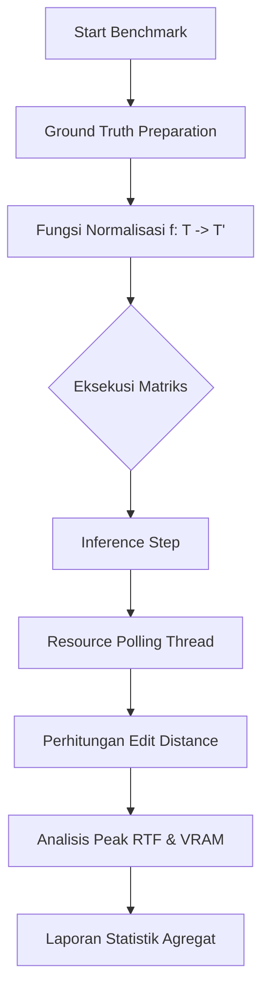

# 📊 Benchmarking Skriptor: Metrik Ilmiah & Evaluasi

Dokumen ini merinci ketelitian matematis dan ilmiah dari suite benchmarking Skriptor, yang menjelaskan bagaimana kami mengukur performa AI di luar observasi sederhana.

---

## 🏗️ Pipeline Evaluasi

Mesin benchmarking mengimplementasikan strategi evaluasi berbasis matriks. Sistem ini mengisolasi variabel (Ukuran Model, Kompleksitas Audio) untuk menentukan konfigurasi yang optimal (pareto-optimal) untuk produksi.

---

## 📐 Metrik Akurasi: Ilmu Pengetahuan tentang Kesalahan

Kami menggunakan **Levenshtein Distance** sebagai metrik inti untuk penyelarasan (alignment) tingkat kata dan karakter.

### 2.1 Word Error Rate (WER)
WER mengukur jarak antara hipotesis (output ASR) dan referensi (ground truth).
$$WER = \frac{S + D + I}{N}$$
*   **$S$ (Substitutions):** Kata yang diganti.
*   **$D$ (Deletions):** Kata yang hilang dari hipotesis.
*   **$I$ (Insertions):** Kata ekstra dalam hipotesis.
*   **$N$:** Total kata dalam referensi.

### 2.2 Character Error Rate (CER)
CER mengikuti logika yang sama tetapi pada tingkat karakter, yang sangat penting untuk mengidentifikasi kesalahan ejaan fonetik yang halus.
$$CER = \frac{EditDistance(ref_{chars}, hyp_{chars})}{TotalChars_{ref}}$$

### 2.3 Algoritma Levenshtein (Dynamic Programming)
Untuk menghitung jumlah minimum edit, kami menggunakan matriks DP $D$ berukuran $(|ref|+1) \times (|hyp|+1)$:
$$D(i, j) = \min \begin{cases} 
D(i-1, j) + 1 & \text{(Deletion)} \\ 
D(i, j-1) + 1 & \text{(Insertion)} \\ 
D(i-1, j-1) + \mathbb{1}_{ref_i \neq hyp_j} & \text{(Substitution)} 
\end{cases}$$
Ini memastikan kita menemukan penyelarasan (alignment) yang optimal secara global antara output AI dan ground truth.

---

## ⚡ Metrik Performa

### 3.1 Real-Time Factor (RTF)
RTF adalah metrik utama untuk efisiensi latensi.
$$RTF = \frac{\Delta t_{\text{inference}}}{\Delta t_{\text{audio}}}$$
*   **$RTF < 1.0$:** Lebih cepat dari real-time (Memproses 60 detik audio membutuhkan < 60 detik).
*   **$RTF = 0.1$:** Target Skriptor untuk node performa tinggi (Memproses 1 jam dalam 6 menit).

### 3.2 Analisis Resource Puncak (Peak Resource)
Pemantauan sistem dilakukan melalui polling asinkron frekuensi tinggi:
$$\text{PeakVRAM} = \max_{t \in [0, T]} \{ \text{MemoryUsage}(t) \}$$
Sangat penting untuk menentukan "Minimum Hardware Requirement" untuk setiap ukuran model (misalnya: Turbo vs. Large-v3).

---

## 🧹 Normalisasi & Pra-skor (Pre-scoring)

Teks mentah mengandung "noise" (huruf besar/kecil, tanda baca) yang seharusnya tidak memengaruhi skor akurasi. Kami menerapkan transformasi normalisasi $f$:
$$f(\text{text}) \to \text{lowercase}(\text{strip}(\text{no\_punctuation}(\text{text})))$$
Ini mengisolasi **Akurasi Akustik** AI dari **Kemampuan Format**-nya.

---

## 📊 Ekspor Hasil
1.  **Raw JSON:** Semua titik data individu untuk analisis lebih lanjut.
2.  **Tabel Markdown:** Rata-rata agregat dan standar deviasi.
3.  **Excel/CSV:** Untuk pelacakan longitudinal dan alat pemetaan (graphing).
