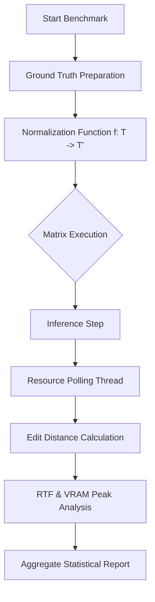

# 📊 Skriptor Benchmarking: Scientific Metrics & Evaluation

This document details the mathematical and scientific rigorousness of the Skriptor benchmarking suite, explaining how we measure AI performance beyond simple observation.

---

## 🏗️ Evaluation Pipeline

The benchmarking engine implements a matrix-based evaluation strategy. It isolates variables (Model Size, Audio Complexity) to determine the pareto-optimal configuration for production.

---

## 📐 Accuracy Metrics: The Science of Error

We use the **Levenshtein Distance** as the core metric for word and character level alignment.

### 2.1 Word Error Rate (WER)
WER measures the distance between the hypothesis (ASR output) and the reference (ground truth).
$$WER = \frac{S + D + I}{N}$$
*   **$S$ (Substitutions):** Words replaced.
*   **$D$ (Deletions):** Words missing from hypothesis.
*   **$I$ (Insertions):** Extra words in hypothesis.
*   **$N$:** Total words in reference.

### 2.2 Character Error Rate (CER)
CER follows the same logic but at the character level, which is critical for identifying subtle phonetic misspellings.
$$CER = \frac{EditDistance(ref_{chars}, hyp_{chars})}{TotalChars_{ref}}$$

### 2.3 The Levenshtein Algorithm (Dynamic Programming)
To calculate the minimum number of edits, we use a DP matrix $D$ of size $(|ref|+1) \times (|hyp|+1)$:
$$D(i, j) = \min \begin{cases} 
D(i-1, j) + 1 & \text{(Deletion)} \\ 
D(i, j-1) + 1 & \text{(Insertion)} \\ 
D(i-1, j-1) + \mathbb{1}_{ref_i \neq hyp_j} & \text{(Substitution)} 
\end{cases}$$
This ensures we find the globally optimal alignment between the AI's output and the ground truth.

---

## ⚡ Performance Metrics

### 3.1 Real-Time Factor (RTF)
RTF is the primary metric for latency efficiency.
$$RTF = \frac{\Delta t_{\text{inference}}}{\Delta t_{\text{audio}}}$$
*   **$RTF < 1.0$:** Faster than real-time (Processing 60s audio takes < 60s).
*   **$RTF = 0.1$:** Skriptor's target for high-performance nodes (Processing 1 hour in 6 minutes).

### 3.2 Peak Resource Analysis
System monitoring is performed via high-frequency asynchronous polling:
$$\text{PeakVRAM} = \max_{t \in [0, T]} \{ \text{MemoryUsage}(t) \}$$
This is critical for determining the "Minimum Hardware Requirement" for each model size (e.g., Turbo vs. Large-v3).

---

## 🧹 Normalization & Pre-scoring

Raw text contains "noise" (casing, punctuation) that shouldn't impact accuracy scores. We apply a normalization transformation $f$:
$$f(\text{text}) \to \text{lowercase}(\text{strip}(\text{no\_punctuation}(\text{text})))$$
This isolates the AI's **Acoustic Accuracy** from its **Formatting Capability**.

---

## 📊 Result Exporting
1.  **Raw JSON:** All individual data points for further analysis.
2.  **Markdown Tables:** Aggregated means and standard deviations.
3.  **Excel/CSV:** For longitudinal tracking and graphing tools.
