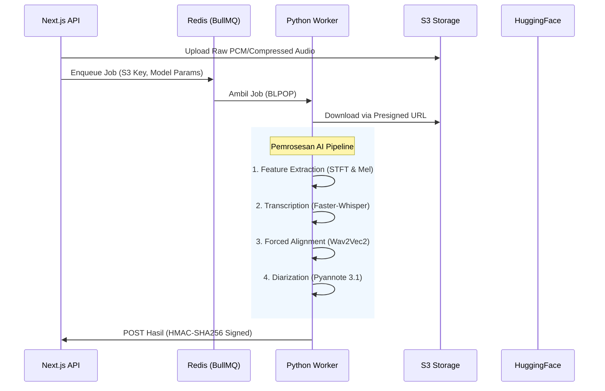

# ⚙️ Skriptor Worker: Pendalaman Ilmiah AI Pipeline

Dokumen ini menyajikan penjelasan teknis dan ilmiah yang mendalam tentang bagaimana Skriptor mengubah audio mentah menjadi teks yang ter-diarize dan selaras (aligned).

---

## 🏗️ Orkestrasi Sistem Tingkat Tinggi

Skriptor beroperasi pada arsitektur terdistribusi di mana **Python Worker** berfungsi sebagai inference engine, menggunakan jaringan saraf (neural networks) khusus untuk setiap tahapan transformasi audio-ke-teks.

---

## 🧬 Langkah 1: Audio Pre-processing & Feature Extraction

Sebelum jaringan saraf "melihat" audio, sinyal tersebut harus diubah dari domain waktu 1D menjadi representasi domain frekuensi 2D.

### 1.1 Short-Time Fourier Transform (STFT)
Sinyal audio kontinu $x(t)$ disampling pada 16kHz dan dibagi menjadi frame yang saling tumpang tindih (overlapping).
$$X(m, \omega) = \sum_{n=-\infty}^{\infty} x[n] w[n - m] e^{-j \omega n}$$
*   **Window ($w$):** Hann window sebesar 25ms.
*   **Hop Length:** 10ms (menjamin kontinuitas temporal).

### 1.2 Mel Filter Bank & Log-Scaling
Manusia tidak mempersepsikan frekuensi secara linear. Kami mengubah spektrum daya ke **Mel Scale**:
$$m = 2595 \log_{10}(1 + \frac{f}{700})$$
1.  **Mel Wrapping:** Besaran STFT dilewatkan melalui 80 filter Mel segitiga.
2.  **Log-Compression:** Untuk menangani dynamic range suara manusia yang tinggi, kami mengambil log: $S_{log-mel} = \log(S_{mel} + \epsilon)$.

---

## 🤖 Langkah 2: Transcription (Whisper vs. Faster-Whisper)

### 2.1 Arsitektur Transformer
Whisper adalah sebuah **Encoder-Decoder Transformer**.
*   **Encoder:** Memproses Log-Mel spectrogram melalui "Convolutional Stem" (dua lapisan 1D Conv dengan aktivasi GELU) dan kemudian melalui $N$ blok Transformer.
*   **Decoder:** Model autoregresif yang memprediksi token berikutnya berdasarkan token sebelumnya dan hidden states dari encoder menggunakan **Cross-Attention**.

**Mekanisme Attention:**
$$\text{Attention}(Q, K, V) = \text{softmax}\left(\frac{QK^T}{\sqrt{d_k}}\right)V$$

### 2.2 Optimalisasi Faster-Whisper (CTranslate2)
Whisper standar (OpenAI) menggunakan inference PyTorch biasa. **Faster-Whisper** menggunakan engine **CTranslate2**, yang memperkenalkan beberapa optimalisasi ilmiah:

| Fitur | Whisper Standar | Faster-Whisper (CTranslate2) |
| :--- | :--- | :--- |
| **Presisi** | FP32 / FP16 | **INT8 / Float16 Quantization** |
| **KV Caching** | Standar | **Cache Pre-allocation** |
| **Inference Engine** | PyTorch JIT | **C++ (Custom Ops)** |
| **VRAM Usage** | Tinggi (Full weights) | **Tereduksi (Weights mapping)** |

**Matematika Quantization (INT8):**
Bobot (weights) $W$ diskalakan dan dibulatkan:
$$W_{q} = \text{round}\left(\frac{W}{S} + Z\right)$$
di mana $S$ adalah scale factor dan $Z$ adalah zero-point. Ini mengurangi kebutuhan bandwidth memori hingga 4x.

---

## 📏 Langkah 3: Forced Alignment (Wav2Vec2 + CTC)

Timestamp dari Whisper bersifat "kasar" (jendela 30 detik). Untuk mendapatkan presisi tingkat kata, kami menggunakan **Forced Alignment**.

### 3.1 Connectionist Temporal Classification (CTC)
Kami menggunakan model **Wav2Vec2** untuk menghasilkan **Emission Matrix** ($P$). Untuk setiap frame waktu $t$, model memprediksi probabilitas sebuah fonem $c$:
$$P(c|t)$$
Berdasarkan transkripsi dari Whisper, kami mencari **Jalur Optimal** ($\pi$) yang memaksimalkan probabilitas menggunakan algoritma Viterbi:
$$\pi^* = \arg\max_{\pi \in \mathcal{B}^{-1}(l)} \prod_{t=1}^T P(\pi_t | t)$$
Di mana $\mathcal{B}$ adalah fungsi CTC collapse. Ini "mengunci" setiap kata ke milidetik yang tepat dalam audio.

---

## 👥 Langkah 4: Speaker Diarization (Pyannote 3.1)

Diarization menjawab pertanyaan "Siapa berbicara kapan?". Ini melibatkan tiga sub-tugas AI yang berbeda:

### 4.1 SincNet Feature Extraction
Alih-alih filter Mel statis, Pyannote menggunakan **SincNet**, yang mempelajari filter bank secara langsung dari raw waveform menggunakan band-pass filter yang dapat dipelajari:
$$y[n] = x[n] * \text{sinc}(2\pi f_2 n) - \text{sinc}(2\pi f_1 n)$$

### 4.2 Speaker Embeddings (Neural Signature)
Segmen ucapan dilewatkan melalui jaringan saraf untuk menghasilkan vektor dimensi tinggi (Embedding) $\vec{e}$. Jika dua segmen $\vec{e}_1$ dan $\vec{e}_2$ memiliki **Cosine Similarity** yang tinggi, maka mereka dianggap milik pembicara yang sama:
$$\text{Similarity} = \frac{\vec{e}_1 \cdot \vec{e}_2}{\|\vec{e}_1\| \|\vec{e}_2\|}$$

### 4.3 Clustering (AHC / Spectral)
Kami membangun similarity matrix untuk semua segmen dan menerapkan **Agglomerative Hierarchical Clustering (AHC)**. Algoritma ini secara iteratif menggabungkan segmen hingga tingkat kemiripan berada di bawah ambang batas (threshold), sehingga mengelompokkan semua segmen "Speaker 0" secara efektif.

---

## 🔒 Keamanan & Integritas Data

### Penandatanganan HMAC-SHA256
Untuk memastikan backend hanya menerima data yang valid dari worker, payload callback ditandatangani:
$$\text{Signature} = \text{HMAC-SHA256}(\text{Key}, \text{Timestamp} + "." + \text{Payload})$$
Ini mencegah serangan "Man-in-the-Middle" atau penulisan database yang tidak sah.

---

## 🗄️ Manajemen Memori

Karena model AI berukuran besar, worker menggunakan **Strategi Cache Singleton**:
- **Model Switching**: Jika sebuah pekerjaan meminta model `large-v3` tetapi cache menyimpan `medium`, worker akan membersihkan VRAM (`torch.cuda.empty_cache()`) dan memuat model baru.
- **Concurrency**: Worker memproses **satu pekerjaan pada satu waktu per GPU** untuk memastikan stabilitas maksimal dan mencegah error Out-of-Memory (OOM).

---

## 📈 Umpan Balik Real-Time (SSE)
Sepanjang langkah-langkah ini, worker mempublikasikan progres ke **Redis Pub/Sub**:
- `10%`: Downloading & STFT
- `40%`: Transcription (Transformer Inference)
- `70%`: Forced Alignment (CTC Segmentation)
- `90%`: Diarization (Embedding & Clustering)

Aplikasi Next.js mendengarkan event ini dan meneruskannya ke pengguna melalui **Server-Sent Events (SSE)**.
