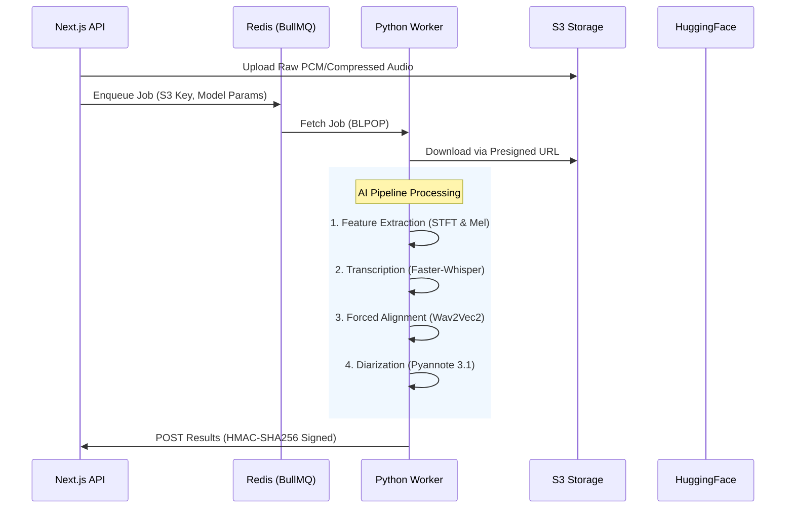

# ⚙️ Skriptor Worker: Scientific AI Pipeline Deep Dive

This document provides a rigorous technical and scientific explanation of how Skriptor transforms raw audio into diarized, aligned text.

---

## 🏗️ High-Level System Orchestration

Skriptor operates on a distributed architecture where the **Python Worker** serves as the inference engine, utilizing specialized neural networks for different stages of the audio-to-text transformation.

---

## 🧬 Step 1: Audio Pre-processing & Feature Extraction

Before any neural network "sees" the audio, it must be converted from a 1D time-domain signal to a 2D frequency-domain representation.

### 1.1 Short-Time Fourier Transform (STFT)
The continuous audio signal $x(t)$ is sampled at 16kHz and divided into overlapping frames.
$$X(m, \omega) = \sum_{n=-\infty}^{\infty} x[n] w[n - m] e^{-j \omega n}$$
*   **Window ($w$):** Hann window of 25ms.
*   **Hop Length:** 10ms (ensuring temporal continuity).

### 1.2 Mel Filter Bank & Log-Scaling
Humans do not perceive frequency linearly. We convert the power spectrum to the **Mel Scale**:
$$m = 2595 \log_{10}(1 + \frac{f}{700})$$
1.  **Mel Wrapping:** The STFT magnitude is passed through 80 triangular Mel filters.
2.  **Log-Compression:** To handle the high dynamic range of human speech, we take the log: $S_{log-mel} = \log(S_{mel} + \epsilon)$.

---

## 🤖 Step 2: Transcription (Whisper vs. Faster-Whisper)

### 2.1 The Transformer Architecture
Whisper is an **Encoder-Decoder Transformer**.
*   **Encoder:** Processes the Log-Mel spectrogram through a "Convolutional Stem" (two 1D Conv layers with GELU activation) and then $N$ Transformer blocks.
*   **Decoder:** An autoregressive model that predicts the next token based on previous tokens and the encoder's hidden states using **Cross-Attention**.

**The Attention Mechanism:**
$$\text{Attention}(Q, K, V) = \text{softmax}\left(\frac{QK^T}{\sqrt{d_k}}\right)V$$

### 2.2 Faster-Whisper (CTranslate2) Optimizations
Normal Whisper (OpenAI) uses standard PyTorch inference. **Faster-Whisper** uses the **CTranslate2** engine, which introduces several "scientific" optimizations:

| Feature | Normal Whisper | Faster-Whisper (CTranslate2) |
| :--- | :--- | :--- |
| **Precision** | FP32 / FP16 | **INT8 / Float16 Kuantisasi** |
| **KV Caching** | Standard | **Cache Pre-allocation** |
| **Inference Engine** | PyTorch JIT | **C++ (Custom Ops)** |
| **VRAM Usage** | High (Full weights) | **Reduced (Weights mapping)** |

**Mathematical Quantization (INT8):**
Weights $W$ are scaled and rounded:
$$W_{q} = \text{round}\left(\frac{W}{S} + Z\right)$$
where $S$ is the scale factor and $Z$ is the zero-point. This reduces memory bandwidth requirements by 4x.

---

## 📏 Step 3: Forced Alignment (Wav2Vec2 + CTC)

Whisper's timestamps are "coarse" (30s window). To get word-level precision, we use **Forced Alignment**.

### 3.1 Connectionist Temporal Classification (CTC)
We use a **Wav2Vec2** model to generate an **Emission Matrix** ($P$). For each time frame $t$, it predicts the probability of a phoneme $c$:
$$P(c|t)$$
Given the transcription from Whisper, we find the **Optimal Path** ($\pi$) that maximizes the probability using the Viterbi algorithm:
$$\pi^* = \arg\max_{\pi \in \mathcal{B}^{-1}(l)} \prod_{t=1}^T P(\pi_t | t)$$
Where $\mathcal{B}$ is the CTC collapse function. This "pins" each word to its exact millisecond in the audio.

---

## 👥 Step 4: Speaker Diarization (Pyannote 3.1)

Diarization answers "Who spoke when?". It involves three distinct AI sub-tasks:

### 4.1 SincNet Feature Extraction
Instead of static Mel filters, Pyannote uses **SincNet**, which learns the filter banks directly from the raw waveform using learnable band-pass filters:
$$y[n] = x[n] * \text{sinc}(2\pi f_2 n) - \text{sinc}(2\pi f_1 n)$$

### 4.2 Speaker Embeddings (The Neural Signature)
Segments of speech are passed through a network to produce a high-dimensional vector (Embedding) $\vec{e}$. If two segments $\vec{e}_1$ and $\vec{e}_2$ have a high **Cosine Similarity**, they belong to the same speaker:
$$\text{Similarity} = \frac{\vec{e}_1 \cdot \vec{e}_2}{\|\vec{e}_1\| \|\vec{e}_2\|}$$

### 4.3 Clustering (AHC / Spectral)
We build a similarity matrix for all segments and apply **Agglomerative Hierarchical Clustering (AHC)**. The algorithm iteratively merges segments until the similarity falls below a threshold, effectively grouping all "Speaker 0" segments together.

---

## 🔒 Security & Data Integrity

### HMAC-SHA256 Signing
To ensure the backend only accepts valid data from the worker, the callback payload is signed:
$$\text{Signature} = \text{HMAC-SHA256}(\text{Key}, \text{Timestamp} + "." + \text{Payload})$$
This prevents "Man-in-the-Middle" attacks or unauthorized database writes.

---

## 📈 Real-Time Feedback (SSE)
Throughout these steps, the worker publishes progress to **Redis Pub/Sub**:
- `10%`: Downloading & STFT
- `40%`: Transcription (Transformer Inference)
- `70%`: Forced Alignment (CTC Segmentation)
- `90%`: Diarization (Embedding & Clustering)

The Next.js app listens to these events and relays them to the user via **Server-Sent Events (SSE)**.